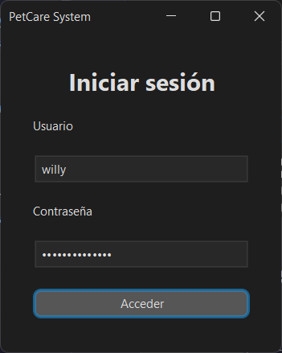
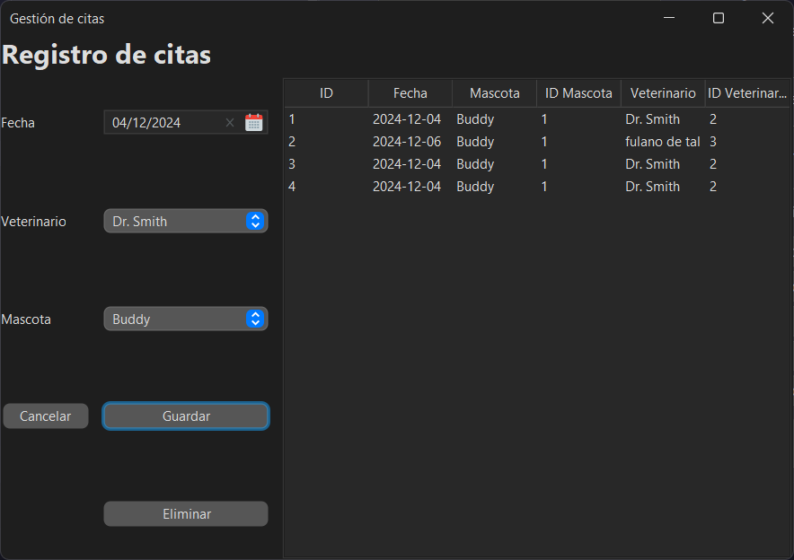
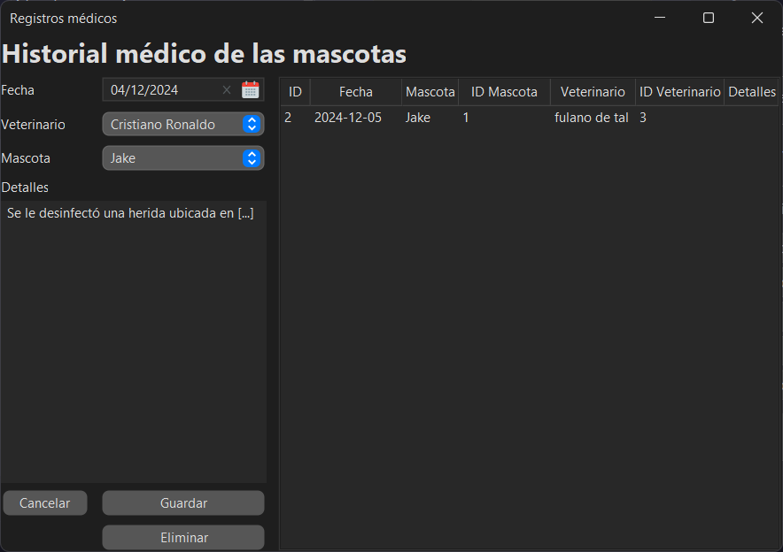
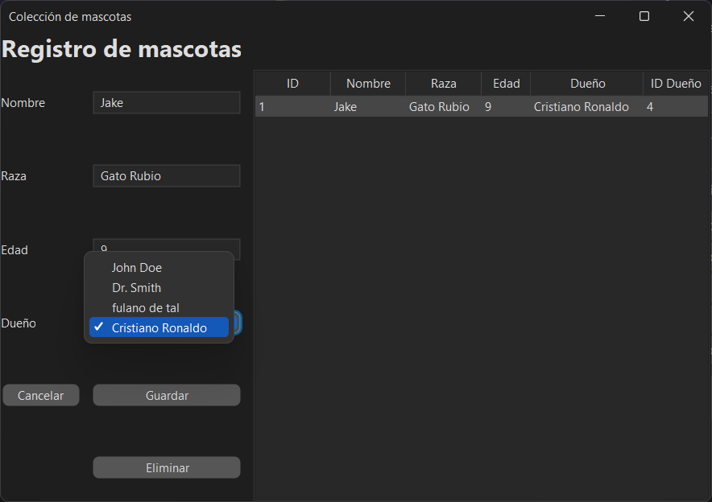
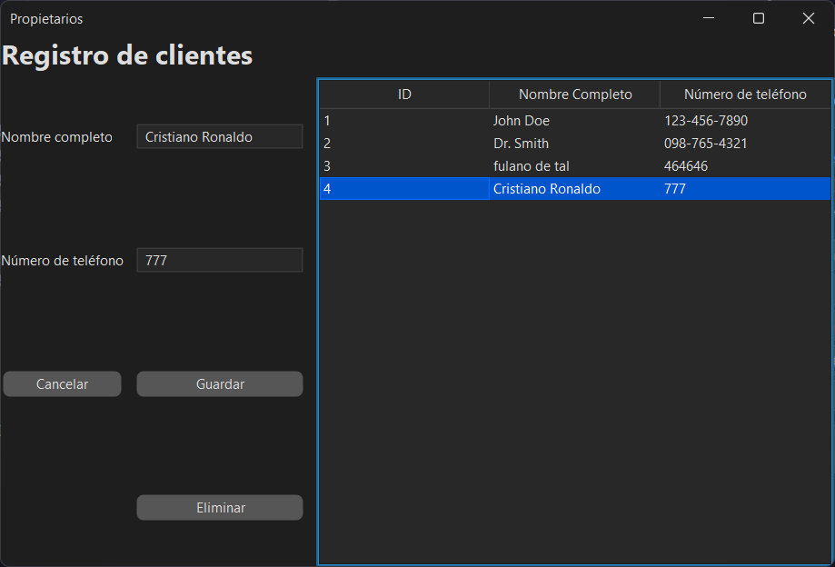
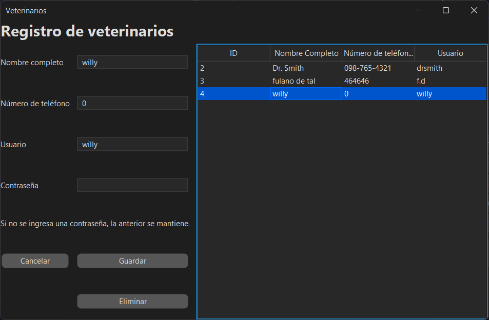
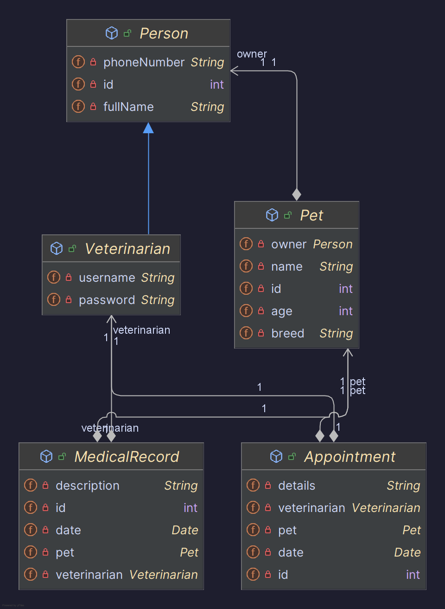

# PetCare System

## Descripción general
PetCare System es una aplicación para gestionar citas veterinarias, registros médicos, mascotas y veterinarios.

## Instrucciones de uso
1. Cloná el repositorio.
2. Abrí el proyecto en IntelliJ IDEA y actualizá las dependencias con Maven.
3. Configurá la conexión a la base de datos en `hibernate.cfg.xml`.
4. Ejecutá la clase `Main` para iniciar la aplicación.

## Funcionalidades básicas
### Autenticación de usuarios  

### Ménu principal  

### Gestión de citas  

### Gestión de registros médicos  

### Gestión de mascotas  

### Gestión de propietarios  

### Gestión de veterinarios  

## Diagrama de clases

## Tecnologías utilizadas
- Java
- Maven
- Swing (para la interfaz gráfica)
- Hibernate
- MySQL 8.0.33

